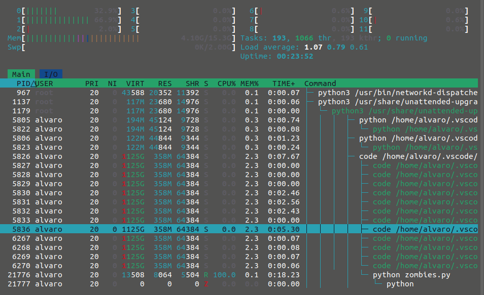

# Process
`Def`: Running program

## States 

In Linux, a process is an instance of executing a program or command. While these processes exist, they’ll be in one of the five possible states:

- Running or Runnable (R)
- Uninterruptible Sleep (D)
- Interruptable Sleep (S)
- Stopped (T)
- Zombie (Z) 

Zombie example

## Main Types of process

1. **Orphan Process:**
   - An orphan process is a child process that continues to run independently after its parent process has terminated or completed its execution.
   - When a parent process creates a child process and then exits (terminates) without waiting for the child to finish, the child becomes an orphan.
   - Orphan processes are then adopted by the operating system's init process (with process ID 1 on Unix-like systems), which becomes their new parent.
   - The init process typically reaps orphaned processes and ensures they don't linger as zombie processes.

2. **Zombie Process:**
   - A zombie process is a terminated process that has completed its execution but still has an entry in the process table (**consuming resources**). 
   - When a child process terminates, it sends an exit status to its parent process. The parent is responsible for collecting this exit status using system calls like `wait()` or `waitpid()`.
   - If the parent fails to collect the exit status (for example, if it has terminated or is not properly handling child process termination), the child process becomes a zombie.
   - Zombie processes do not consume system resources other than a process table entry, but they indicate a failure in proper process management.
   - The operating system's init process typically adopts and reaps zombie processes, freeing up their process table entries.

3. **Daemon Process:**
    - A daemon is a background process that runs independently of any controlling terminal. 
    - Daemons are often used for tasks that need to run continuously, such as system services. Daemons typically detach themselves from the terminal and run in the background, providing services or performing tasks without direct user interaction.
    - Examples of daemons include web servers (e.g., Apache), database servers (e.g., MySQL), and various system services.

## Security issues

### Orphan process

Having orphan processes can be problematic for several reasons:

1. **Resource Leakage:** Orphan processes may continue to consume system resources even after their parent process has terminated. This can lead to resource leakage, where system resources such as memory, file descriptors, and other allocated resources are not released.

2. **Zombie Processes:** When an orphan process terminates, it becomes a zombie process until its exit status is collected by the parent. If the parent process is not available or neglects to collect the exit status, zombie processes accumulate, which can degrade system performance over time.

3. **Potential for Unintended Behavior:** Orphan processes might continue execution in an unexpected manner. Depending on their functionality, they might perform actions that were not intended or could lead to undesired consequences.

4. **Security Risks:** Orphan processes may inherit open file descriptors from their parent. If the parent process opened sensitive files or network connections, the orphaned child might still have access to those resources. This could potentially lead to security vulnerabilities if the orphan process is compromised or exploited.

5. **Difficulty in Debugging:** Orphan processes can make debugging and system analysis more challenging. If unexpected behavior or performance issues arise, it might be harder to trace the cause back to the orphaned processes.

To prevent orphan processes, it's essential for the parent process to handle the termination of its child processes properly. This usually involves setting up signal handlers to catch termination signals (e.g., `SIGCHLD`) and performing necessary cleanup operations.

Ensuring that all child processes are properly terminated and their resources are released helps maintain a stable and efficient system. It's good practice for the parent process to wait for its child processes to terminate and collect their exit statuses, avoiding the creation of orphan processes.

### Daemon process

Daemon processes themselves are not inherently dangerous; in fact, they are crucial for the proper functioning of many systems. Daemons run in the background and provide essential services or perform specific tasks without requiring direct user interaction. Examples include web servers, database servers, and various system services. However, while daemons themselves are not dangerous, improper configuration or vulnerabilities in daemon processes can pose risks. Here are some potential risks associated with daemon processes:

1. **Security Vulnerabilities:**
   - If a daemon process has security vulnerabilities, it may be exploited by malicious actors to gain unauthorized access or compromise the system's integrity.
   - It's crucial to keep daemon software up-to-date with the latest security patches and configurations to minimize the risk of exploitation.

2. **Improper Permissions:**
   - Daemon processes often run with specific user privileges. If these privileges are too broad, it may allow unauthorized access or unintended actions.
   - Properly configuring permissions and running daemons with the least necessary privilege is essential to reduce security risks.

3. **Resource Consumption:**
   - Poorly designed or misconfigured daemons may consume excessive system resources, leading to performance issues or even system crashes.
   - Monitoring and resource management are important to ensure that daemons operate efficiently and do not degrade system performance.

4. **Lack of Monitoring:**
   - Failing to monitor daemon processes can result in undetected issues. For example, a critical daemon might stop working, leading to a disruption in services.
   - Regular monitoring and alerting mechanisms help identify and address potential problems promptly.

5. **Inadequate Logging:**
   - Daemons should log relevant information, including errors and activities, for troubleshooting and auditing purposes.
   - Lack of proper logging can make it challenging to identify and address issues, especially during security incidents.

## Process vs theards

| Aspect                       | Processes                               | Threads                                |
| ---------------------------- | ---------------------------------------| ---------------------------------------|
| **Definition**               | Independent program units, each with its own memory space. | Lightweight units of a process, sharing the same memory space. |
| **Creation Overhead**        | Generally higher overhead due to separate memory space. | Lower overhead as threads share the same memory space. |
| **Communication**            | Inter-process communication (IPC) required for communication. | Intra-process communication can be achieved more easily. |
| **Memory Space**             | Separate memory space for each process. | Shared memory space within the same process. |
| **Isolation**                | Strong isolation between processes. | Less isolation between threads; they can directly access each other's data. |
| **Parallelism**              | Better parallelism as processes run in separate memory spaces. | Limited parallelism within a process due to shared memory. |
| **Fault Tolerance**          | More fault-tolerant as a failure in one process usually does not affect others. | Less fault-tolerant as a failure in one thread can potentially affect the entire process. |
| **Use Cases**                | Useful for CPU-bound tasks, parallel processing, or running independent tasks. | Suitable for I/O-bound tasks, asynchronous programming, or tasks that require frequent communication. |
| **Complexity**               | Higher complexity due to separate memory spaces and communication overhead. | Lower complexity as threads share the same memory space and can communicate more easily. |
| **Synchronization**          | Generally requires synchronization mechanisms like locks and semaphores for data integrity. | Easier synchronization as threads share the same memory space, but still requires care to avoid race conditions. |
| **Overhead**                 | Higher overhead due to separate memory space and communication overhead. | Lower overhead due to shared memory space, but still some overhead for synchronization. |
| **Examples**                 | Separate applications running concurrently. | Web server handling multiple client requests concurrently. |

## References

- [States](https://www.geeksforgeeks.org/process-states-and-transitions-in-a-unix-process/)
- [Zombie](https://www.geeksforgeeks.org/zombie-processes-prevention/)