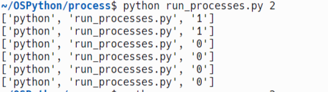

Respond this questions about run_processes.py

a) What happens if run_processes is executed without any arguments?
The program will end and the phrase "Usage: python run_processes.py <number>" will be displayed.

b) What will the first child process created during the execution of run_processes 3 do?

The first child process forks another child process and them decrements the value that was entered as the argument and displays this to the terminal. This is recursive until the argument is less than 0.

c) Draw the process tree resulting from the execution of run_processes 3.

COME BACK TO THIS QUESTION

d) What would be the total number of processes created during the execution of run_processes 3, not counting the original parent process? 
The total number of processes created during the execution of run_processes 3 would be 14.

e) Reason whether, by executing run_processes 3, there could be any orphaned processes and/or any zombie processes. An orphaned process is considered to be one whose parent has died and is adopted by the init process.

In this script there could have been an orphaned process created if line 25 in the code was not present. This forces the parent process to wait for the child process, so that the child does not get orphaned. Additionally, if line 25 was not present a zombie process could be created because the parent process would fail to wait for the child. However, with the script the way it is now there could not be any orphaned or zombie processes.

