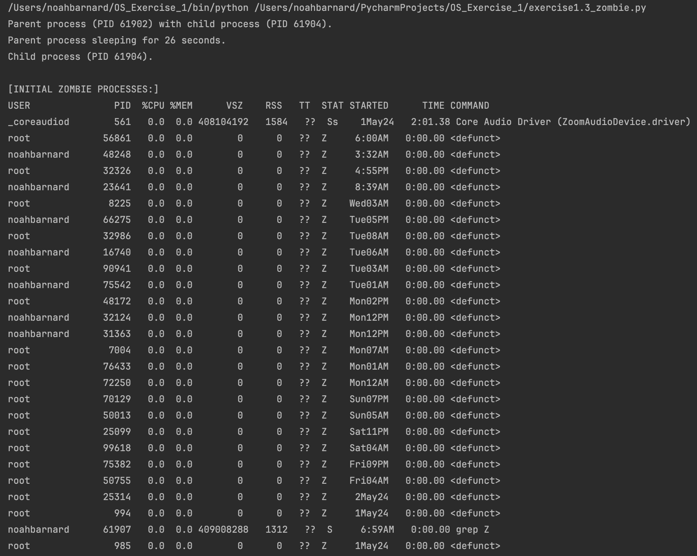
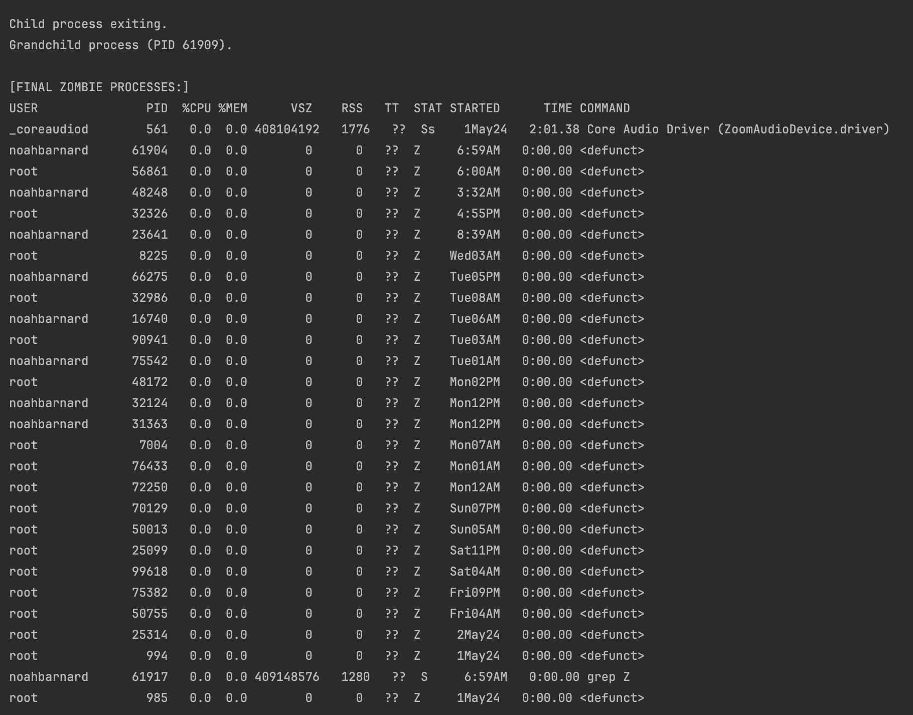
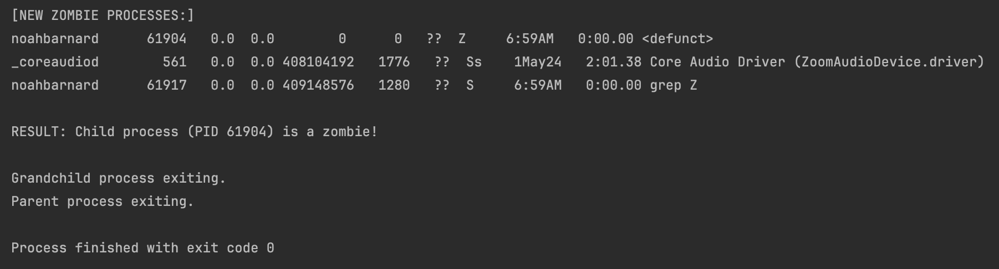

# Exercise 1.1

```bash
(sleep 2; echo "Hello") &
```

# Exercise 1.2

Create a Bash Terminal in Python.

The first argument of the script receives a `cmd/bash` command.

The script forks and then executes the command with `exec`.

# Exercise 1.3

Execute [exercise1.3_zombie.py](exercise2.1_run_processes.py).

Upload a photo in this markdown that demonstrates that the process is a zombie.




