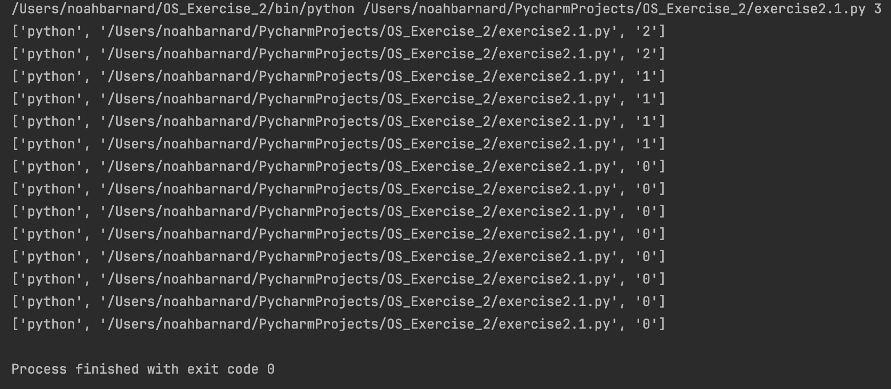
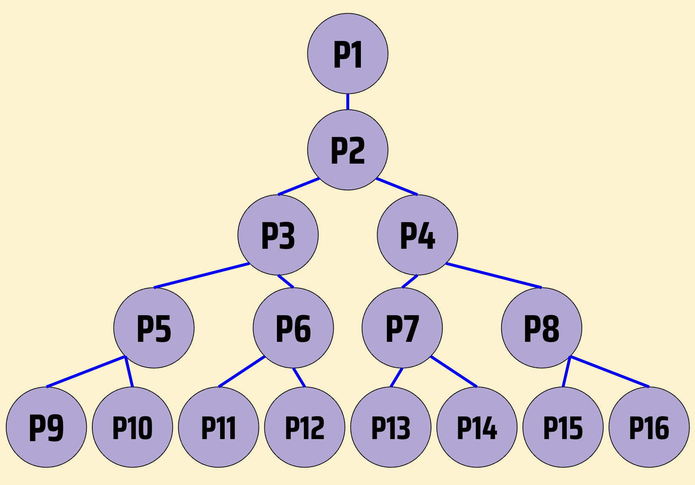
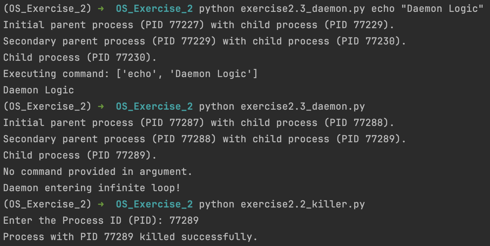
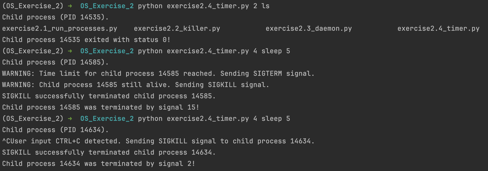

# Exercise 2.1

Respond this questions about [exercise2.1_run_processes.py](exercise2.1_run_processes.py)

a) **What happens if `run_processes` is executed without any arguments?**

 • The program prints the error message "Usage: python &lt;file_path&gt; &lt;number&gt;" and then exits with status 1, indicating a failure during execution.

---

b) **What will the first child process created during the execution of `run_processes 3` do?**

 • The first child created will enter the child code branch and immediately fork again. Afterwards, it will create arguments for a new execution of the script, using the same &lt;command&gt; ("python") and &lt;file_path&gt; arguments as its own execution but decrementing its &lt;number&gt; argument by 1. These new arguments are printed to the terminal before the running process is overwritten by "os.execvp("python", arguments)", which runs that new execution of the script.

Upload a photo in this markdown of the full output.

---

c) **Draw the process tree resulting from the execution of `run_processes 3`.**

Upload a photo in this markdown of the process tree.

---

d) **What would be the total number of processes created during the execution of `run_processes 3`, not counting the original parent process?**

 • 15 processes.

---

e) **Reason whether, by executing `run_processes 3`, there could be any orphaned processes and/or any zombie processes. An orphaned process is considered to be one whose parent has died and is adopted by the `init` process.**

 • After each fork, the parent process enters the code branch with the line "os.waitpid(pid, 0)", which requires it to wait for its child process to finish. Thus, the parent process will never die without waiting for its child process, so there could not be any orphaned processes. This also means that the child process will never die while not being waited on by its parent process, so there too could not be any zombie processes.

# Exercise 2.2

The objective of this exercise is to develop a process through the use of Python’s os and signal modules that simulates the `kill -9 <pid>` command.

# Exercise 2.3

Create a daemon process.

-Daemon processes start working when the system is bootstrapped and terminate only when the system shuts down (as they do not have parents).

-Daemon processes do not have a controlling terminal. They always runs in the background.

Upload a photo in this markdown of the killer and daemon scripts implemented in exercises 2.2 and 2.3 functioning correctly.

# Exercise 2.4

Code a Unix program in Python with the invocation `timer seconds command [args...]` that is capable of limiting the maximum execution time of the command indicated as an argument.

- The indicated command (mandate) will be executed in a child process with the arguments (args...) indicated in the invocation.
- If the user presses Ctrl-C the indicated command (mandate) should die, but the parent process (temporize) should not.
- If the child process does not finish before the time (seconds) indicated, the parent should warn it by sending the proper signal.
- If it has not finished (the child process) one second later, the parent should kill it.
- In any of these cases, the parent process must decode the termination status of the child process, display said status on the standard output, and terminate correctly.

Upload a photo in this markdown of the timer script functioning correctly.

