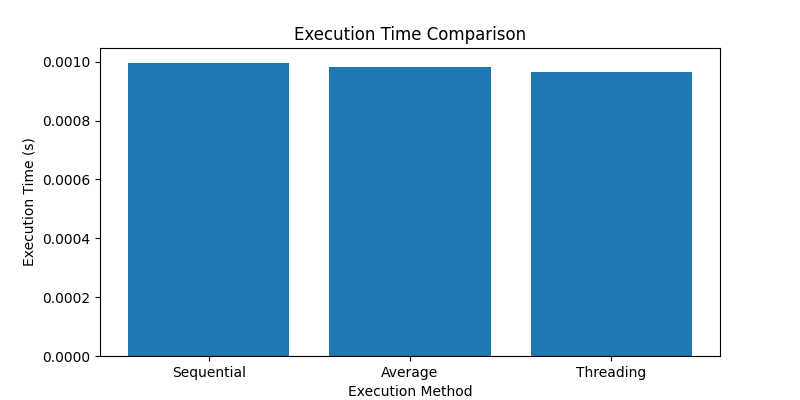

# Thread Analysis

## Calculation Confirmation
Overall value means are equal! (59.91447699050968)

## Execution Times
- Sequential: 0.0007159709930419922 seconds
- Threading: 0.0008349418640136719 seconds 
- Average: 0.000775456428527832 seconds

## Bar Graph

## Conclusion
The Sequential method is faster than the Threading method by 0.00011897087097167969 seconds.
