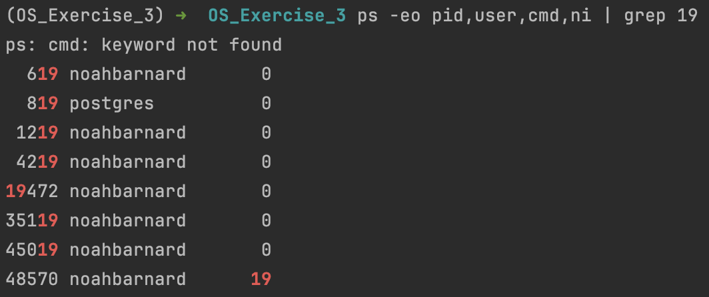

# Exercise 3.1

Using a dataframe: first, calculate the average of its columns sequentialy. Then, calculate it utilizing threads. Finally, compare the times (with results reported in a .md file called "exercise_3.1_thread_analysis.md").

# Exercise 3.2 (Optional)

Exploring Process Priority with Python

This exercise delves into manipulating process priority in Python and verifying the changes using the `ps` command.

**Instructions:**

1. **Import the `subprocess` module:**

   This module allows you to execute system commands from your Python script.

2. **Construct the Command:**

   - Use the `nice` command to set process priority.
   - Include the `-19` flag to assign a high negative niceness value (higher priority).
   - Combine `nice` with `sleep 30` to execute a process that pauses for 30 seconds.

3. **Execute the Command:**

   - Utilize the `subprocess` module to run the constructed command.
   - Implement error handling to capture any potential issues during execution.

4. **Verify Process Priority:**

   - Open a separate terminal window.
   - Execute the command `ps -eo pid,user,cmd,ni | grep 19` to list processes with niceness -19.
   - You should observe the executed `sleep` process with the increased priority reflected in the "ni" column.

Upload a photo in this markdown with the verified terminal output showing the sleep process's high priority of -19 niceness.

