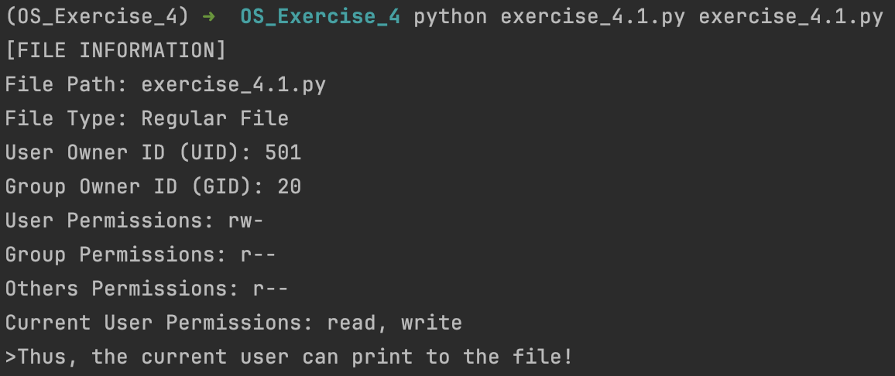
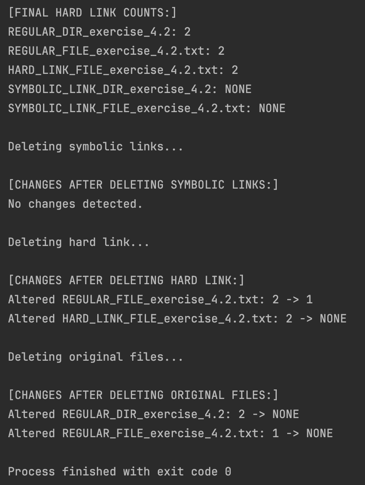
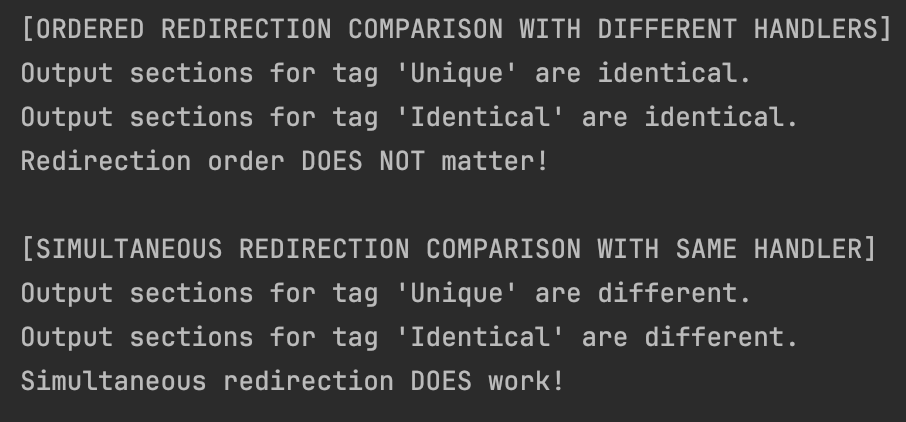

# Exercise 4.1

Write a Python script to check file permissions and determine if the current user can write to a specified file. The script should:

1. **Import necessary modules** for file system interactions and permission interpretation.
2. **Define a function** that takes a file path as input and performs the following:
    - Retrieves file information using system calls.
    - Decodes the permissions into a human-readable format.
    - Checks for write permission using appropriate functions.
3. **Implement error handling** to catch file not found or other potential issues.
4. **Accept the file path as a command-line argument** when running the script.
5. **Display the file permissions** and print access status (has write permission or not) for the current user.

**Note:** Consider allowing the user to input the file path interactively if no argument is provided.

Upload a photo in this markdown with the file information output.

# Exercise 4.2 

Create with python a rigid and a simbolic `ln(1)`:
- With the `-s` option, a symbolic link is created. Create a symbolic link to a regular file and another to a directory. Verify the result with `ls -l` and `ls -i`. Determine the inode of each file.
- Repeat the previous section with hard links. Determine the inodes of the files and the properties with `stat` (observe the link count attribute).
- What happens when one of the hard links is deleted? What happens if one of the symbolic links is deleted? And if the original file is deleted?

- **Note** : To create the simbolic link you can use commands or python.

Upload a photo in this markdown of the changes in hard link counts after each type of link is deleted.

# Exercise 4.3

 Write a program that redirects the standard output to a file whose path is passed as the first argument. Test this by having the program write several strings to the standard output. Also, redirect the standard error output to the file. Verify the operation by including several statements that print to both streams. Is there a difference if the redirections are performed in a different order? 

The output of exercise 4.3 demonstrates that the order of the redirection has no effect on the output. In iteration 1, the standard output is redirected to the file first, followed by the standard error, while in iteration 2, the order is reversed. Despite this, the outputs of both iterations are identical (stdout writes all of its statements earliest, which are followed by stderr), indicating that the order of redirection does not effect the output, even with multiple handlers pointing to the same file. The only method that created a difference in output was on iteration 3 when the standard output and standard error output were redirected simultaneously, having not just the same file but the same handler. This resulted in the output simply being chronological in the order of the print statements, with no distinction between stdout and stderr. These conclusions are supported by the output of the program, which is displayed below.

