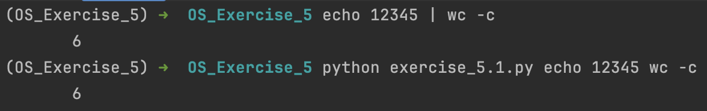

# Exercise 5.1

Write a program that emulates the behavior of the shell in executing a statement in the form:  ​
```
cmd1 arg1 | cmd2 arg2 ​
```
Upload a photo in this markdown showing the program properly emulating the behavior of a shell pipe command.


